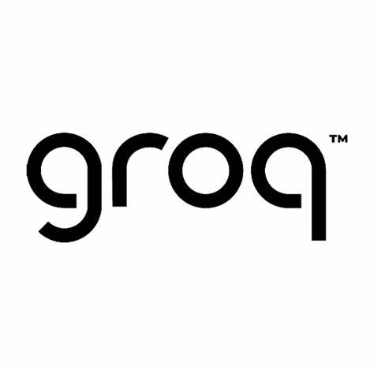

# HTN 2024 Scavenger Hunt 🔎
Our project for Hack The North 2024

## What is Scavenger Hunt 🤔
Scavenger Hunt is a game to create and join scavenger hunt games to help new university students learn and get acclimatized to the campus 🏫. 

## How to Play 🌟

### Organizers 📃
1. Start a hunt using the Create Game tab, filling out information about the objects and their hiding locations, play area, and contact information
<!-- List of objects Specify object
Specify room
Maybe riddle depending on time
Share the game to the players-->
2. Share the passcode to your players, so they can join the game
3. Start the game, and watch through the Game Dashboard!

### Players 👤
1. Find and join a game on the Join Game tab
2. Enter your username for leaderboard purposes 📶
3. Get your first hint, and use the MappedIn map implementation to locate potential rooms 🗺️
4. Submit a photo of your item to a survey on Genesys
(Item has a code on it attached)
5. If your item is confirmed by a moderator, recieve a hint for the next item
(Perhaps the user could have 2 riddle/hunts open at a time, and they must find an object to get the next revealed)
7. Repeat until someone finds all the items!

### Point System 📊
* The first player to find each object wins 2 points
* The first player to find all the objects wins 5 points
* The player with the most points at the end of the game wins 🏆

### Code of Conduct 📌
1. Safety first! ⚠️ We know that scavenger hunts are exciting, espcially when the race is close, but make sure safety comes first! You have the opportinuity to play as many scavenger hunts as you want, but only one life you can live!
2. HAVE FUN! Transitioning to university is stressful (but fun), and we want to make sure you have fun! 😎👌🔥

## Sponsor Tools Used 🤝
### Groq

Groq powers our riddle generator, and generates hints for items based on the location, type of item, and hiding method.
### MappedIn

Mappedin powers our map implementation, which helps players find their next item by making it easier for them to navigate around campus.
### Genesys

Genesys powers our item verification system. When players find an item, they send an image to a Genesys survey, where it can be verified by a Scavenger Hunt organizer/moderator.

